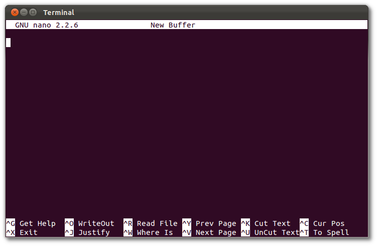

[vscode]: https://code.visualstudio.com/
[shell-data]: https://swcarpentry.github.io/shell-novice/data/shell-lesson-data.zip
[python-data]:https://swcarpentry.github.io/python-novice-gapminder/files/python-novice-gapminder-data.zip

## Unix-Shell

### 1. Have you got nano on your machine?

Check if `nano` there by opening a terminal and writing the following:

~~~
$ nano 
~~~

The terminal should show a screen with a bar on top saying `GNU nano` and with a
menu in the bottom.

Press <kbd>ctrl</kbd> + <kbd>x</kbd> to exit.

#### Would you like to use other text editor?

For your future work, nano would not be too helpful. 
For that we'd recommend [Visual Studio Code][vscode]. 
But There are many others, feel free to ask to the team if there's some other text editor you'd like to use (after the workshop).

### 2. Download the data needed for the workshop

You need to download some files to follow this lesson:

 - Make a new folder in your Desktop called shell-novice.
 - Download [shell-novice-data.zip][shell-data] and move the file to this folder. 
    If it’s not unzipped yet, double-click on it to unzip it. You should end up with a new folder called data.

Your new directory should show the following folders:

You can access this folder from the Unix shell with:
    
~~~
$ cd ~/Desktop/shell-novice/data
~~~

Do you get a warning or error message? Mention it to the teaching team before the start of the workshop.

## Git

### 1. Git in your machine

Check that it works by opening a **new** terminal window and execute:

~~~
$ git --version
~~~

If you get something like:

~~~
git version 2.x.x
~~~

You are done, if you get something like

~~~
bash: git: command not found
~~~

Then the installation has not work properly

### 2. GitHub

Create an account on [github](https://github.com/join) and make sure you remember
your username and password.

## Python

### 1. Download the data needed for the workshop

You need to download some files to follow this lesson:

 - Make a new folder in your Desktop called python-
 - Download [python-novice-gapminder-data.zip][python-data] and move the file to this folder. 
   If it’s not unzipped yet, double-click on it to unzip it. You should end up with a new folder called data.

Your new directory should show the following folders:

You can access this folder from the Unix shell with:

~~~
$ cd ~/Desktop/python-novice-gapminder/data
~~~

### 2. Check the extra dependencies

...
